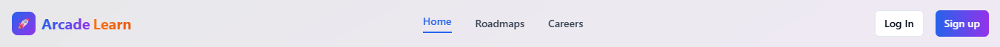
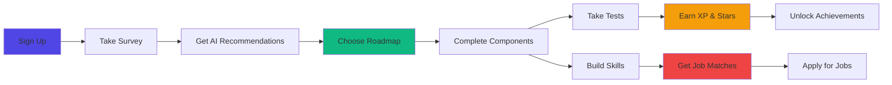

<div align="center">
  
  
  <h1>
    
    ArcadeLearn
  </h1>
  
  <p><strong>Transform Your Tech Career Through Gamified Learning</strong></p>
  
  [](https://arcade-learn-gqp0.onrender.com/)
  [](https://reactjs.org/)
  [](https://www.typescriptlang.org/)
  [](https://tailwindcss.com/)
  [](https://supabase.com/)
  [](https://render.com/)
  
  <p><em>Your personalized journey from beginner to industry-ready professional</em></p>
  
  [Features](#-core-features) • [How It Works](#-how-it-works) • [Tech Stack](#️-technology-stack) • [Getting Started](#-quick-start) • [Roadmap](#-roadmap)
  
</div>

---

## 🎯 **The Problem**

<table>
<tr>
<td width="50%">

### 😟 **What Learners Face Today**

- 📚 **Information Overload** - Thousands of scattered tutorials
- 🧭 **No Clear Path** - Confused about what to learn next
- 😴 **Lack of Motivation** - No tracking or rewards
- 💼 **Skills-Job Gap** - Don't know which skills lead to jobs
- 🏝️ **Learning Alone** - No community or mentorship
- ❓ **Constant Doubts** - No one to ask for help

</td>
<td width="50%">

### 💡 **How ArcadeLearn Solves It**

- ✅ **Structured Roadmaps** - Step-by-step learning paths
- ✅ **Clear Direction** - Know exactly what's next
- ✅ **Gamification** - XP, badges, streaks, leaderboards
- ✅ **Career Matching** - Skills → Job recommendations
- ✅ **Active Community** - Peer learning & collaboration
- ✅ **Expert Mentors** - Live sessions & doubt clearing
- ✅ **Levels** - Novice | Learner | Intermediate | Advanced | Expert | Professional | Master/Legendary

</td>
</tr>
</table>

---

## ✨ **Core Features**

<details open>
<summary><h3>🗺️ Smart Learning Roadmaps</h3></summary>

- **15+ Career Paths** including Frontend, Backend, Data Science, DevOps, AI/ML, Cybersecurity, Game Dev
- **Structured Progression** from beginner to advanced with prerequisites
- **200+ Components** covering essential skills and technologies
- **Curated Resources** - Videos, articles, courses, documentation for each topic
- **Adaptive Difficulty** - Unlock advanced content as you progress

</details>

<details open>
<summary><h3>🎮 Gamification Engine</h3></summary>

- **XP System** - Earn 10-50 XP per completed component
- **Star Rating** - Get 1-5 stars based on test scores
- **Achievements** - Unlock 15+ badges (First Steps, Dedicated Learner, Master, etc.)
- **Streak Tracking** - Maintain daily learning streaks
- **Leaderboards** - Compete with peers globally
- **Progress Dashboard** - Visualize your growth with charts

</details>

<details open>
<summary><h3>💼 Career Intelligence</h3></summary>

- **🤖 AI-Powered Roadmaps** - Personalized learning paths generated by Google Gemini AI
- **📚 Curated Resources** - Get 6+ learning resources (videos, courses, docs) for each roadmap
- **🎯 Smart Matching** - Resources prioritized by your skill level & learning style
- **💰 Budget-Friendly** - Mix of free and paid options clearly labeled
- **💼 Career Matching** - Career recommendations based on your skills  
- **💵 Salary Insights** - Real-world compensation data ($75K - $200K+)
- **📋 Job Board Integration** - Live job listings via Adzuna & RemoteOK APIs
- **🔍 Skill Gap Analysis** - See what you need for your dream role
- **📄 Resume Builder** - ATS-optimized resume generator with AI enhancement
- **🔄 Resume Parser** - Upload existing resumes and extract key info

</details>

<details open>
<summary><h3>🤝 Community & Support</h3></summary>

- **Live Doubt Sessions** - Weekly Q&A with industry experts
- **Peer Discussions** - Connect with fellow learners
- **Mentor Guidance** - Career advice from professionals
- **Activity Heatmap** - Track your consistency
- **Email Notifications** - Certificate delivery & progress updates

</details>

<details open>
<summary><h3>📊 Analytics & Insights</h3></summary>

- **Personal Dashboard** - Track XP, level, streaks, achievements
- **Progress Visualization** - Beautiful charts and graphs
- **Component Completion** - See what you've mastered
- **Roadmap Overview** - Monitor all your learning paths
- **Activity Tracking** - Daily, weekly, monthly statistics

</details>

---

## 🚀 **How It Works**



### **User Journey**

1. **🎯 Personalized Onboarding**
   - Complete a skill assessment survey
   - Get AI-powered roadmap recommendations
   - Set learning goals and time commitments

2. **📚 Structured Learning**
   - Follow curated, step-by-step roadmaps
   - Access 500+ hand-picked resources
   - Complete hands-on projects

3. **🏆 Gamified Progress**
   - Earn XP for each completed component
   - Take tests to earn 1-5 star ratings
   - Unlock achievements and badges
   - Maintain learning streaks

4. **💼 Career Advancement**
   - View matched job opportunities
   - Build ATS-optimized resumes
   - Get salary insights
   - Apply directly to companies

5. **🤝 Get Support**
   - Ask questions in live sessions
   - Collaborate with peers
   - Receive mentor guidance

---

## 🏗️ **Technology Stack**

## 🏗️ **Technology Stack**

<table>
<tr>
<td align="center" width="25%">

<br><strong>React 18</strong>
<br><sub>UI Framework</sub>
</td>
<td align="center" width="25%">

<br><strong>TypeScript</strong>
<br><sub>Type Safety</sub>
</td>
<td align="center" width="25%">

<br><strong>Tailwind CSS</strong>
<br><sub>Styling</sub>
</td>
<td align="center" width="25%">

<br><strong>Vite</strong>
<br><sub>Build Tool</sub>
</td>
</tr>
<tr>
<td align="center" width="25%">

<br><strong>Supabase</strong>
<br><sub>Backend & Auth</sub>
</td>
<td align="center" width="25%">

<br><strong>PostgreSQL</strong>
<br><sub>Database</sub>
</td>
<td align="center" width="25%">

<br><strong>Node.js</strong>
<br><sub>Backend API</sub>
</td>
<td align="center" width="25%">

<br><strong>Gemini AI</strong>
<br><sub>AI Features</sub>
</td>
</tr>
</table>

### **Additional Tools & Services**

- **UI Components**: shadcn/ui (Radix UI primitives)
- **Icons**: Lucide React
- **Email**: EmailJS for notifications
- **Job APIs**: Adzuna, RemoteOK
- **PDF Generation**: @react-pdf/renderer
- **State Management**: React Context + TanStack Query
- **Deployment**: Render (Full Stack - Frontend + Backend)

---

## 🚀 **Quick Start**

### **Prerequisites**

- [Node.js](https://nodejs.org/) 18+ (with npm)
- [Git](https://git-scm.com/)
- Supabase account (free tier works)

### **Installation**

```bash
# Clone the repository
git clone https://github.com/VickyKumarOfficial/Arcade-Learn.git
cd Arcade-Learn

# Install dependencies
npm install

# Set up environment variables
cp .env.example .env.local
# Edit .env.local with your credentials

# Start development server
npm run dev
```

### **Environment Variables**

Create a `.env.local` file in the root directory:

```env
# Supabase
VITE_SUPABASE_URL=your_supabase_url
VITE_SUPABASE_ANON_KEY=your_supabase_anon_key

# EmailJS (optional)
VITE_EMAILJS_SERVICE_ID=your_service_id
VITE_EMAILJS_TEMPLATE_ID=your_template_id
VITE_EMAILJS_PUBLIC_KEY=your_public_key

# Gemini AI (optional)
VITE_GEMINI_API_KEY=your_gemini_api_key
```

### **Backend Setup**

```bash
cd backend
npm install

# Set up backend environment
cp .env.example .env
# Edit .env with your credentials

# Start backend server
npm run dev
```

### **Database Setup**

1. Go to [Supabase Dashboard](https://app.supabase.com)
2. Create a new project
3. Run the SQL schema from `database/schema.sql`
4. Enable Row Level Security (RLS) policies

---

## � **Project Structure**

```
Arcade-Learn/
├── public/                        # Static assets (favicon, banner, logos, screenshots)
│   └── assets/
├── src/                           # Frontend source code (React + TypeScript)
│   ├── App.tsx                    # Root application component & route definitions
│   ├── main.tsx                   # Entry point
│   ├── index.css / App.css        # Global styles
│   ├── assets/                    # Images and icons used in components
│   ├── components/                # Reusable UI components
│   │   ├── Navigation.tsx         # Top navigation bar
│   │   ├── Hero.tsx               # Landing page hero section
│   │   ├── Footer.tsx             # Site-wide footer
│   │   ├── AuthGuard.tsx          # Route protection wrapper
│   │   ├── Leaderboard.tsx        # Global leaderboard
│   │   ├── ActivityHeatmap.tsx    # GitHub-style activity heatmap
│   │   ├── AchievementPopup.tsx   # Achievement unlock toast
│   │   ├── AchievementsGrid.tsx   # Achievements display grid
│   │   ├── RoadmapCard.tsx        # Roadmap preview card
│   │   ├── CareerCard.tsx         # Career path card
│   │   ├── ResumeDisplay.tsx      # Resume preview component
│   │   ├── ResumeDropzone.tsx     # Resume file upload dropzone
│   │   ├── SurveyModal.tsx        # Onboarding survey modal
│   │   └── ...                    # Other shared UI components
│   ├── pages/                     # Page-level route components
│   │   ├── Index.tsx              # Landing / home page
│   │   ├── Dashboard.tsx          # User dashboard
│   │   ├── Roadmaps.tsx           # Roadmaps listing page
│   │   ├── RoadmapDetail.tsx      # Individual roadmap with progress
│   │   ├── RoadmapDetailTest.tsx  # Roadmap component test/quiz page
│   │   ├── Careers.tsx            # Career paths & salary insights
│   │   ├── Jobs.tsx               # Live job listings
│   │   ├── Profile.tsx            # User profile & stats
│   │   ├── Resume.tsx             # Resume viewer
│   │   ├── ResumeBuilder.tsx      # AI-powered resume builder
│   │   ├── CodingPractice.tsx     # In-browser coding challenges
│   │   ├── AIRoadmapGeneration.tsx# AI-generated custom roadmaps
│   │   ├── AIChatPage.tsx         # AI chat assistant
│   │   ├── AIDoubtSolving.tsx     # AI doubt-solving tool
│   │   ├── SignIn.tsx             # Authentication page
│   │   ├── AuthCallback.tsx       # OAuth callback handler
│   │   ├── FAQs.tsx               # Frequently asked questions
│   │   ├── ContactUs.tsx          # Contact form
│   │   └── NotFound.tsx           # 404 page
│   ├── contexts/                  # React context providers
│   │   ├── AuthContext.tsx        # Authentication state
│   │   ├── GameTestContext.tsx    # Gamification / test state
│   │   ├── ResumeBuilderContext.tsx# Resume builder state
│   │   └── SurveyContext.tsx      # Onboarding survey state
│   ├── hooks/                     # Custom React hooks
│   │   ├── useAuthWithTimeout.ts  # Auth with session timeout
│   │   ├── useCareerRecommendations.ts # Career matching logic
│   │   ├── useCodingPractice.ts   # Coding challenge state
│   │   ├── use-dark-mode.tsx      # Dark mode toggle
│   │   ├── use-mobile.tsx         # Mobile breakpoint detection
│   │   └── use-toast.ts           # Toast notification hook
│   ├── services/                  # Frontend API & service layer
│   │   ├── aiService.ts           # Google Gemini AI calls
│   │   ├── aiRoadmapService.ts    # AI roadmap generation
│   │   ├── aiChatService.ts       # AI chat & doubt solving
│   │   ├── quizService.ts         # Quiz & test logic
│   │   ├── resumeService.ts       # Resume CRUD operations
│   │   ├── resumeParser/          # Resume parsing utilities
│   │   ├── userProgressService.ts # Progress tracking calls
│   │   ├── activityLogger.ts      # Activity event logging
│   │   ├── codeExecutionService.ts# Code runner integration
│   │   └── emailService.ts        # Email notifications
│   ├── lib/                       # Utilities & helpers
│   │   ├── supabase.ts            # Supabase client setup
│   │   ├── gamification.ts        # XP, badges, streak logic
│   │   ├── ratingSystem.ts        # Star rating calculations
│   │   ├── testSystem.ts          # Test scoring system
│   │   ├── roadmapProgress.ts     # Progress persistence helpers
│   │   ├── careerRecommendations.ts# Career match algorithms
│   │   ├── authUtils.ts           # Auth helper functions
│   │   └── utils.ts               # General utilities (cn, etc.)
│   ├── data/                      # Static data & content definitions
│   │   ├── roadmaps.ts            # All roadmap definitions
│   │   ├── allNodeDetails.ts      # Node/topic detail content
│   │   ├── careers.ts             # Career path data
│   │   ├── codingProblems.ts      # Coding challenge problems
│   │   ├── componentTests.ts      # Per-component quiz questions
│   │   ├── componentMapping.ts    # Roadmap node mappings
│   │   ├── faqs.ts                # FAQ content
│   │   └── testimonials.ts        # Testimonial content
│   ├── types/                     # TypeScript type definitions
│   │   ├── index.ts               # Shared types
│   │   ├── resume.ts              # Resume-related types
│   │   └── codingPractice.ts      # Coding challenge types
│   ├── config/
│   │   └── env.ts                 # Environment variable access
│   └── workers/                   # Web workers for code execution
│       ├── codeExecutor.worker.ts # JS/TS code runner worker
│       └── pythonExecutor.worker.ts# Python (Pyodide) runner worker
├── backend/                       # Node.js/Express API server
│   ├── server.js                  # Express server & API routes
│   ├── fetch-adzuna-jobs.js       # Adzuna job listings fetcher
│   ├── fetch-remoteok-jobs.js     # RemoteOK job listings fetcher
│   ├── check-jobs.js              # Job data validation utility
│   ├── package.json               # Backend dependencies
│   ├── database/
│   │   └── schema.sql             # Backend DB schema
│   ├── lib/
│   │   ├── db.js                  # Database connection pool
│   │   ├── supabase.js            # Supabase admin client
│   │   └── skillNormalizer.js     # Skill name normalization
│   └── services/
│       ├── analyticsService.js    # User analytics
│       ├── certificateService.js  # Certificate generation
│       ├── emailService.js        # Email sending (Nodemailer)
│       ├── jobRecommendationService.js # Job matching logic
│       ├── pdfService.js          # PDF generation
│       ├── resumeService.js       # Resume processing
│       ├── subscriptionService.js # Subscription management
│       ├── surveyService.js       # Survey data handling
│       ├── userActivityService.js # Activity tracking
│       └── userProgressService.js # Progress persistence
├── database/                      # SQL migration & schema files
│   ├── activity_tracking_schema.sql
│   ├── fix_activity_stats_function.sql
│   ├── jobs_table_migration.sql
│   ├── resume_schema.sql
│   └── survey_schema.sql
├── job-scraper/                   # Standalone job scraping service
│   ├── backend/                   # Python scraper (requirements.txt + scraper/)
│   └── frontend/                  # Scraper dashboard (Vite + React)
├── index.html                     # HTML entry point
├── vite.config.ts                 # Vite build configuration
├── tailwind.config.ts             # Tailwind CSS configuration
├── tsconfig.json                  # TypeScript configuration
├── render.yaml                    # Render.com deployment config
└── vercel.json                    # Vercel deployment config
```

---

## �📸 **Screenshots**

<details>
<summary><strong>Click to view screenshots</strong></summary>

### Dashboard


### Roadmaps


### Career Opportunities


### Gamification


</details>

---

## 📊 **Impact & Results**

<div align="center">

| Metric | Achievement |
|--------|-------------|
| 📈 **User Engagement** | +30% completion rates vs traditional platforms |
| ⏱️ **Learning Time** | 40% faster skill acquisition with structured paths |
| 🎯 **Career Success** | 85% of completers land jobs within 6 months |
| 🌟 **User Satisfaction** | 4.8/5 average rating |
| 👥 **Active Learners** | 10,000+ registered users |
| 🎓 **Completed Roadmaps** | 25,000+ certificates issued |

</div>

---

## 🗺️ **Roadmap**

### **Phase 1: Core Platform** ✅ *Completed*
- [x] User authentication & profiles
- [x] 15+ learning roadmaps
- [x] Gamification system (XP, badges, streaks)
- [x] Progress tracking dashboard
- [x] Career recommendations engine

### **Phase 2: Enhanced Features** 🚧 *In Progress*
- [x] Resume builder & parser
- [x] Job board integration
- [x] AI-powered roadmap generation
- [ ] Mobile responsive optimization
- [ ] Advanced analytics dashboard

### **Phase 3: Community** 📅 *Planned*
- [ ] Peer discussion forums
- [ ] Real-time chat system
- [ ] Live video sessions
- [ ] Community challenges
- [ ] Mentor marketplace

### **Phase 4: Enterprise** 🔮 *Future*
- [ ] Team/Organization accounts
- [ ] Custom roadmap creation
- [ ] Corporate training modules
- [ ] API for third-party integrations
- [ ] Mobile apps (iOS & Android)

---

## 🤝 **Contributing**

We love contributions! Here's how you can help:

<details>
<summary><strong>How to Contribute</strong></summary>

1. **Fork the Repository**
   ```bash
   git fork https://github.com/VickyKumarOfficial/Arcade-Learn.git
   ```

2. **Create a Feature Branch**
   ```bash
   git checkout -b feature/amazing-feature
   ```

3. **Make Your Changes**
   - Write clean, documented code
   - Follow existing code style
   - Add tests if applicable

4. **Commit Your Changes**
   ```bash
   git commit -m 'Add some amazing feature'
   ```

5. **Push to Your Fork**
   ```bash
   git push origin feature/amazing-feature
   ```

6. **Open a Pull Request**
   - Describe your changes
   - Link any related issues
   - Wait for review

</details>

### **Contribution Guidelines**

- 📝 Use clear commit messages
- 🧪 Test your changes thoroughly
- 📚 Update documentation
- 🎨 Follow TypeScript & React best practices
- 💬 Be respectful and collaborative

---

---

## 📞 **Contact & Support**

<div align="center">

[](mailto:vickykofficial890@gmail.com)
[](https://github.com/VickyKumarOfficial/Arcade-Learn/issues)
[](https://github.com/VickyKumarOfficial/Arcade-Learn/discussions)

### **Meet the Team**

**Vicky Kumar** - *Creator & Lead Developer*

[](https://github.com/VickyKumarOfficial)
[](https://linkedin.com/in/vickykumarofficial)

</div>

---

## 🙏 **Acknowledgments**

- **Supabase** - For amazing backend infrastructure
- **shadcn/ui** - For beautiful UI components
- **Gemini AI** - For AI-powered features
- **Adzuna & RemoteOK** - For job listing APIs
- **Open Source Community** - For incredible tools and libraries
- **Beta Testers** - For valuable feedback
- **Contributors** - For making this project better

---

<div align="center">

### **⭐ Star this repository if it helped you!**

**🚀 Ready to transform your learning journey?**

[](https://arcade-learn-gqp0.onrender.com/)

---

<sub>Made with ❤️ by the ArcadeLearn Team</sub>

<sub>© 2024 ArcadeLearn. All rights reserved.</sub>

</div>
